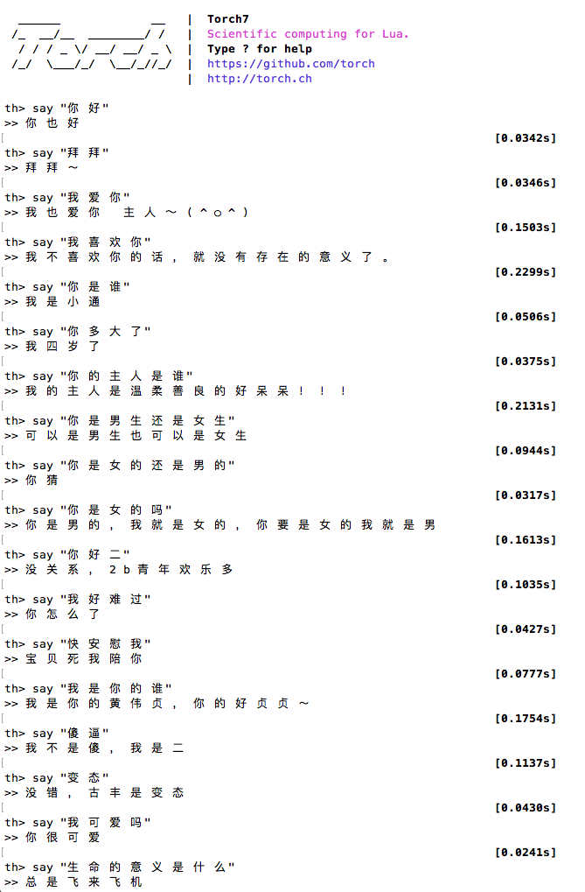
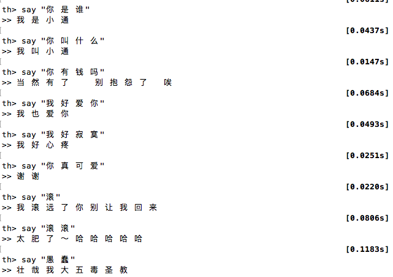

# Neural Conversational Model in Torch

## Installing

1. [Install Torch](http://torch.ch/docs/getting-started.html).
2. Install the following additional Lua libs:

   ```sh
   luarocks install nn
   luarocks install rnn
   luarocks install penlight
   ```
   
   To train with CUDA install the latest CUDA drivers, toolkit and run:

   ```sh
   luarocks install cutorch
   luarocks install cunn
   ```
   
   To train with opencl install the lastest Opencl torch lib:

   ```sh
   luarocks install cltorch
   luarocks install clnn
   ```

3. Download the [dgk_lost_conv 中文对白语料](https://github.com/dgkae/dgk_lost_conv) and unzip `results/xiaohuangji50w_fenciA.conv.zip`  into `data/`.

## Training

```sh
th train.lua [-h / options]
```

Use the `--dataset NUMBER` option to control the size of the dataset. Training on the full dataset takes about 5h for a single epoch.

The model will be saved to `data/model.t7` after each epoch if it has improved (error decreased).

## Testing

To load the model and have a conversation:

```sh
th eval.lua
```


##How
Use https://github.com/dgkae/dgk_lost_conv as training corpus. The chinese sentenses should be splited by semantic words, using '/'. We modify cornell_movie_dialog.lua to support it. Lua save all string(e.g. chinese) all in multibyte, so in chinese the formal pl.lexer is not working. We use outsider word-splitting tool and using '/' as the tag.

##Result





## License

MIT 

